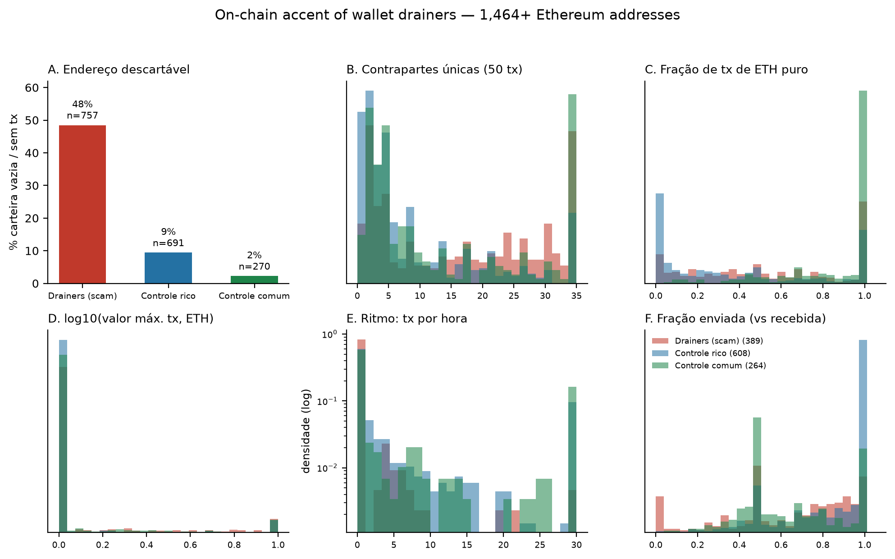

<p align="center">
  <h1 align="center">The Disposable Wallet</h1>
  <p align="center"><b>Behavioral signatures of cryptocurrency drainer addresses on Ethereum</b></p>
  <p align="center">An empirical, fully reproducible study of 1,464 + 264 wallets</p>
</p>

<p align="center">
  <a href="https://doi.org/10.5281/zenodo.23136778"></a>
  <a href="https://github.com/clebson-scott/sistema-gestao-pecab/actions/workflows/ci.yml"></a>
  
  
  
</p>

---

> **Do wallet drainers carry a measurable on-chain behavioral signature, before and during their operation?**
>
> Yes. Drainer addresses behave like *disposable tools*: nearly half are empty or transaction-less, and the active ones transact in a recognizable rhythm — more unique counterparties, near-dormant cadence, larger maximum values — a signature that survives both rich and matched-common control groups.

## Key findings

| # | Finding | Evidence |
|---|---------|----------|
| 1 | **Disposability** — 48.5% of malicious addresses are empty/transaction-less | vs 9.5% of rich honest controls and 2.2% of matched common users (chi² = 266.7, p ≈ 6e-60) |
| 2 | **The accent** — drainers transact with more unique counterparties (~17 vs 10-15), at a near-dormant rhythm (~1.1 tx/h vs 19-39), with larger maximum values | CLES effect sizes, permutation tests p < 0.001 |
| 3 | **Prediction** — a logistic classifier on 8 behavioral features identifies malicious addresses | 70.0% accuracy / AUC 0.784 vs rich controls; 74.6% vs matched common controls, 5-fold CV |



## Quickstart

```bash
pip install -r requirements.txt   # numpy, matplotlib, fpdf
make all                          # analysis + permutation verification + figure + paper
```

Every number in the paper regenerates from the raw datasets included in this repository — **zero cost, zero API calls**:

```bash
make analysis      # chi², Mann-Whitney, 5-fold logistic CV  -> analysis/results/resultado_analise.json
make verify        # reproduces published means & CLES to 1e-9, runs seeded permutation tests
make figure        # regenerates Figure 1
make paper         # regenerates the PDF preprint
make collect       # (optional, slow) re-collect everything from the public Blockscout v2 API
```

Re-collecting from scratch (network required, still free):

```bash
make collect       # collection/coleta.py -> coleta3.py + conserta.py + controle_comum.py
```

## Repository map

```
sistema-gestao-pecab/
├── README.md                  ← you are here
├── CITATION.cff               ← "Cite this repository" (GitHub renders this)
├── LICENSE                    ← CC-BY 4.0
├── CONTRIBUTING.md            ← how to propose analyses, report data issues
├── SECURITY.md                ← responsible disclosure for a security-research repo
├── CODE_OF_CONDUCT.md
├── Makefile                   ← make analysis | verify | figure | paper | collect | all
├── requirements.txt
├── .github/
│   ├── workflows/ci.yml       ← CI regenerates every number and checks reproducibility
│   └── ISSUE_TEMPLATE/       ← bug report / data report / question templates
├── data/
│   ├── README.md              ← provenance of every address and dataset
│   ├── seed/                  ← original seeds (ScamSniffer list, control candidates)
│   ├── dataset.jsonl          ← 757 scam + 707 honest, batch 1
│   ├── dataset2.jsonl         ← batch 2 (dedup + expansion)
│   ├── dataset3.jsonl         ← batch 3 (dedup + expansion)
│   └── dataset_comuns.jsonl   ← 264 matched common users (pure-ETH senders)
├── collection/                ← the pipeline that talks to Blockscout v2
│   ├── README.md              ← collector order, dedup logic, the counter-fix story
│   ├── coleta.py / coleta2.py / coleta3.py
│   ├── conserta.py            ← fixes raw counter fields after an API bug
│   └── controle_comum.py      ← matched common-control sampler
├── analysis/
│   ├── README.md
│   ├── analise.py             ← chi², Mann-Whitney, logistic 5-fold CV
│   ├── permutacao.py          ← reproduction verifier + seeded permutation tests
│   └── results/               ← canonical published outputs + reproduction reports
├── figures/
│   ├── figura.py              ← Figure 1 generator (6 panels)
│   └── figura_sotaque_drainer.png
├── paper/
│   ├── paper_drainer.py       ← PDF generator
│   └── paper_drainer.pdf      ← the preprint (also on Zenodo)
└── docs/
    ├── METHODOLOGY.md         ← sample construction, features, statistics, honest caveats
    ├── FINDINGS.md            ← every number, with its source file
    ├── DATA_DICTIONARY.md     ← field-by-field definition of every dataset record
    └── REPRODUCING.md         ← step-by-step, including the CI verification
```

## Documentation

- [Methodology](docs/METHODOLOGY.md) — how the 1,464-wallet sample was built, what the 8 features mean, which tests were run, and the declared limitations of each control group
- [Findings](docs/FINDINGS.md) — the complete result table with pointers to the exact JSON files
- [Data dictionary](docs/DATA_DICTIONARY.md) — every field of every record
- [Reproducing](docs/REPRODUCING.md) — local and CI reproduction, verified to the last digit

## Ethics & scope

Defensive research. All addresses are public (blockchain) or come from vendor incident reports. No exploit, no deanonymization, no first-strike. Motivating application: **[ZEUS GUARD](https://github.com/clebson-scott/zeus-guard)**, the open-source pre-transaction firewall.

## Citation

```bibtex
@dataset{araujo2026disposable,
  author  = {Araujo, Clebson Campos de},
  title   = {The Disposable Wallet: Behavioral Signatures of Cryptocurrency Drainer Addresses on Ethereum},
  year    = {2026},
  month   = {10},
  day     = {4},
  doi     = {10.5281/zenodo.23136778},
  url     = {https://zenodo.org/records/23136778},
  license = {CC-BY-4.0},
  note    = {ZEUS GUARD Security Lab (independent)}
}
```

Zenodo record: <https://zenodo.org/records/23136778>

## Author

**Clebson Campos de Araujo** — ZEUS GUARD Security Lab (independent). Graduate student in AI and Digital Automation (UniFECAF), Arbitrum-certified developer, author of preprints in phytoacoustics and on-chain security.

## License

[CC-BY 4.0](LICENSE) — matching the Zenodo deposit. Data, code, figures and paper, all of it.
